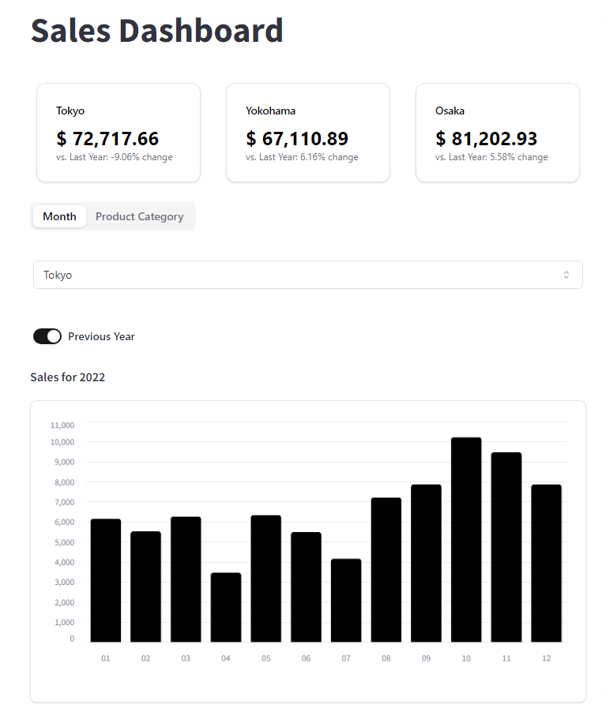

# Streamlit Sales Dashboard with Shadcn UI

This project presents a sales dashboard utilizing Streamlit and the [Shadcn UI package](https://github.com/ObservedObserver/streamlit-shadcn-ui). It provides insights into sales data across different cities, showcasing both annual and monthly performance metrics.
### 👉 Access the dashboard: [https://www.shadcn-dashboard.streamlit.app/](https://shadcn-dashboard.streamlit.app/)

## Demo

## Video Tutorial (Coming soon!)

## 🤓 Check Out My Excel Add-ins
I've developed some handy Excel add-ins that you might find useful:

- 📊 **[Dashboard Add-in](https://pythonandvba.com/grafly)**: Easily create interactive and visually appealing dashboards.
- 🤪 **[Emoji Add-in](https://pythonandvba.com/emojify)**: Add a touch of fun to your spreadsheets with emojis.
- 🛠️ **[MyToolBelt Add-in](https://pythonandvba.com/mytoolbelt)**: A versatile toolbelt for Excel, featuring:
  - Creation of Pandas DataFrames and Jupyter Notebooks from Excel ranges
  - ChatGPT integration for advanced data analysis
  - And much more!

## 🤝 Connect with Me
- 📺 **YouTube:** [CodingIsFun](https://youtube.com/c/CodingIsFun)
- 🌐 **Website:** [PythonAndVBA](https://pythonandvba.com)
- 💬 **Discord:** [Join the Community](https://pythonandvba.com/discord)
- 💼 **LinkedIn:** [Sven Bosau](https://www.linkedin.com/in/sven-bosau/)
- 📸 **Instagram:** [sven_bosau](https://www.instagram.com/sven_bosau/)

## Support 
If you appreciate the project and wish to encourage its continued development, consider [supporting my work](https://pythonandvba.com/coffee-donation).

## Feedback & Collaboration
For feedback, suggestions, or potential collaboration opportunities, reach out at contact@pythonandvba.com.

