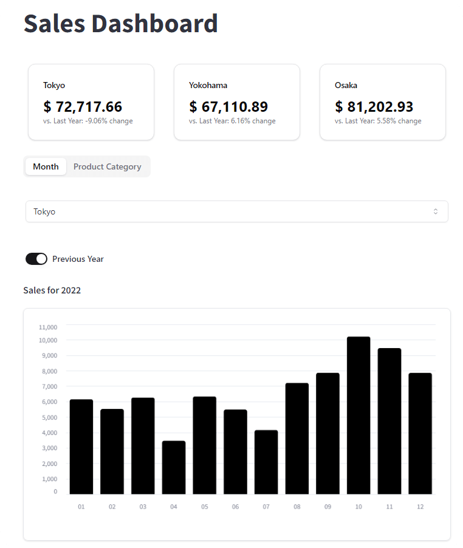

# Streamlit Sales Dashboard with Shadcn UI

This project presents a sales dashboard utilizing Streamlit and the [Shadcn UI package](https://github.com/ObservedObserver/streamlit-shadcn-ui). It provides insights into sales data across different cities, showcasing both annual and monthly performance metrics.
### 👉 Access the dashboard: [https://www.shadcn-dashboard.streamlit.app/](https://shadcn-dashboard.streamlit.app/)

## Demo

## Video Tutorial (Coming soon!)

## More Solutions
Explore my tools and templates for Excel, automation, and more.

**[View all solutions](https://pythonandvba.com/solutions)**
## Connect with Me
- **YouTube:** [CodingIsFun](https://youtube.com/c/CodingIsFun)
- **Website:** [PythonAndVBA](https://pythonandvba.com)
- **LinkedIn:** [Sven Bosau](https://www.linkedin.com/in/sven-bosau/)
- **Contact:** [Get in Touch](https://pythonandvba.com/contact)
## Support 
If you appreciate the project and wish to encourage its continued development, consider [supporting my work](https://pythonandvba.com/coffee-donation).

## Feedback & Collaboration
For feedback, suggestions, or potential collaboration opportunities, reach out at contact@pythonandvba.com.

